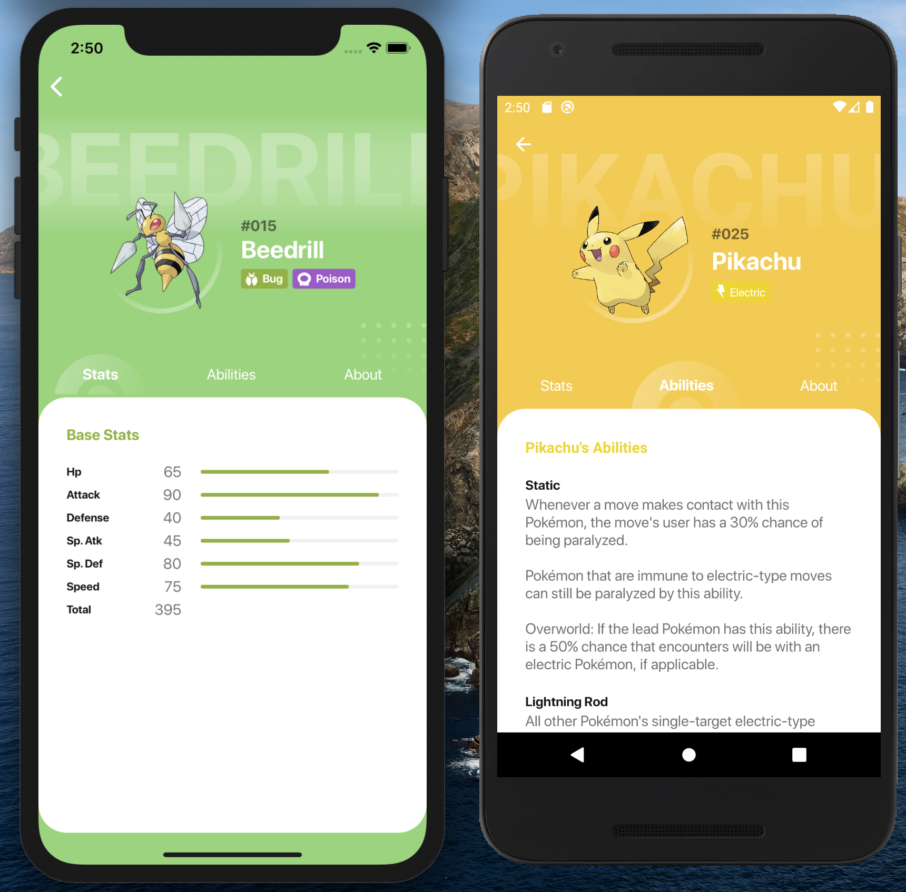

# React-Native Pokédex Challenge

## Requisitos: 
- Node 14.x
- [Instalar e configurar React-Native](https://reactnative.dev/docs/environment-setup)
- Xcode atualizado + emuladores/dispositivos
- Android Studio + SDK + Java8 + emuladores/dispositivos

## Instruções
- Clone este repositório: `https://github.com/vedovato/rn-pokedex-challenge.git`
- Instale dependências do projeto: `npm install`
- Instale dependências do iOS: `cd ios && pod install`
- Inicie o Metro Bundler: `npm start`

## Informações gerais
- Senha da keystore é `vedovato`;
- Para rodar a versão iOS, utilize o arquivo `*.wcworkspace` localizado na pasta `ios` ou o comando `npm run ios` a partir da raiz do projeto, via terminal.

## NPM Scripts
- `npm start`: Inicia o "compilador" do React-Native;
- `npm run android`: Roda a versão debug no Android (dispositivo conectado ou emulador);
- `npm run android:adb-reverse`: Encaminha o trafego para as portas corretas;
- `npm run android:release-build`: Gera versão release do app;
- `npm run android:release-install`: Instala a versão de release no dispositivo/emulador para testes;
- `npm run react-native run-ios`: Roda verão debug no disposito/emulador iOS.

## Funcionamento geral
- A lista inicial de pokémons é carregada no momento da inicialização do app através da execução das `sagas/watchers` e seu resultado armazenado na store`;
- Para cada item recebido, acontece uma solicitação para a API com o objetivo de recuperar mais informações do pokémon. O resultado é `unificado aos dados iniciais` pelo app via `redux-saga`;
- Todos os itens em exibição na lista de pokémons já possuem mais informações adicionais baixadas e prontas para consumo sem solicitação adicional ao servidor;
- Todo conteúdo baixado fica disponível para acesso em `modo offline`;
- A paginação utiliza a tecnica de paginação infinita e ocorre quando o usuário está chegando ao fim da lista de pokémons. O novo conteúdo solicitado passa pelo mesmo `worker/saga` da solicitação inicial (DRY)
- Os ícones de tipos de pokémons foram implementados como custom-font;
- As imagens dos pokémons vem [deste site](https://pokeres.bastionbot.org/images/pokemon/1.png), a partir do ID do pokémon;
- A filtragem de pokémons suporta a pesquisa por `ID global`, `partes do nome` ou `conjunto de letras` do nome de cada pokémon. Ex: "char", "1", "5", "bulba" etc
- As cores e detalhes do app são dinâmicos de acordo com o tipo de cada pokémon

## Requisitos atendidos 🤓
- React 16.11;
- React-Native 0.62:
	- [react-native-navigation](https://wix.github.io/react-native-navigation/);
	- [react-native-vector-icons](https://github.com/oblador/react-native-vector-icons);
	- [react-native-tab-view](https://github.com/react-native-community/react-native-tab-view);
- Hooks;
- Redux;
- Redux-Saga;
- Styled-Components.

## Requisitos não atendidos 😭
- Storybook;
- Typescript;
- Testes.
